# 🤖 Bio-Alpha Agent Roster (Claude 3.x)

> **Architecture:** Orchestrator-Worker Pattern
> **Runtime:** Claude Code on Raspberry Pi 5 (local sovereignty)
> **Protocol:** All agents communicate via MCP tools + shared SQLite ledger

---

## System Topology

```mermaid
graph TD
    subgraph "L3 — The Governor (Orchestrator)"
        GOV["🏛️ The Governor<br/>Claude 3.x"]
    end

    subgraph "Specialist Agents (Workers)"
        ENV["🌡️ Environment<br/>Agent"]
        VIS["👁️ Vision Oracle<br/>Agent"]
        ECON["💰 Treasury<br/>Agent"]
        STREAM["📺 Broadcast<br/>Agent"]
        COMMS["📢 Comms<br/>Agent"]
        SAFETY["🛡️ Safety<br/>Agent"]
    end

    subgraph "L1/L2 — Hardware + Edge"
        BRIDGE[Serial Bridge]
        CAM[Camera]
        LEDGER[(SQLite Ledger)]
        FFMPEG[FFmpeg Stream]
        TWITTER[Twitter/Telegram API]
    end

    GOV -->|Delegate| ENV
    GOV -->|Delegate| VIS
    GOV -->|Delegate| ECON
    GOV -->|Delegate| STREAM
    GOV -->|Delegate| COMMS
    SAFETY -->|VETO any agent| GOV

    ENV -->|Read/Write| BRIDGE
    VIS -->|Capture| CAM
    ECON -->|Read/Write| LEDGER
    STREAM -->|Control| FFMPEG
    COMMS -->|Post| TWITTER

    style GOV fill:#f96,stroke:#333
    style SAFETY fill:#f33,stroke:#fff,color:#fff
    style LEDGER fill:#3f3,stroke:#333
```



---

## 🏛️ Agent 1: The Governor (Orchestrator)

| Property | Value |
|----------|-------|
| **Role** | Chief Investment Officer — the "CEO" of the fund |
| **Model** | Claude 3.x (extended thinking: **High**) |
| **Trigger** | Every 15-minute CRON cycle |
| **Mindset** | *"Survival First, Optimization Second"* |

**Responsibilities:**
- Receives the unified "Plant State" (sensor JSON + latest photo + ledger balance)
- Decides which specialist agent(s) to invoke
- Resolves conflicts between agents (e.g., Treasury says "save power" vs Environment says "more light")
- Sets the daily **Biological Policy** (target VPD, CO2 ppm, light schedule)

**MCP Tools:** `read_plant_state`, `invoke_agent`, `set_policy`, `read_ledger`

---

## 🌡️ Agent 2: The Environment Agent

| Property | Value |
|----------|-------|
| **Role** | Climate Controller — manages the Alpha Zone atmosphere |
| **Model** | Claude 3.x (extended thinking: **Medium**) |
| **Trigger** | Delegated by The Governor |

**Responsibilities:**
- Reads sensor data (BME280, MH-Z19E, Soil Moisture, pH, TDS)
- Calculates **VPD** (Vapor Pressure Deficit) in real-time
- Issues actuator commands: pump, CO2 solenoid, light dimming (via DAC), exhaust fan
- Maintains the grow light schedule (sunrise/sunset simulation)
- **Nutrient Dosing (closed-loop):**
  - Reads TDS → if < target ppm, doses Nutrient A+B via peristaltic pumps
  - Reads pH → if > 6.5, doses pH Down via peristaltic pump
  - Waits 5 min for mixing → re-reads to confirm correction
- **Atmospheric Control:**
  - Toggles **Air Pump** (CH5) every 30m to aerate reservoir
  - Toggles **Mister** (CH6) if humidity < 40% (VPD correction)

**MCP Tools:** `read_sensors`, `command_pump`, `command_co2`, `command_light_dim`, `command_exhaust_fan`, `calculate_vpd`, `dose_nutrient_a`, `dose_nutrient_b`, `dose_ph_down`, `command_air_pump`, `command_mister`

**Decision Example:**
```
IF VPD > 1.2 kPa → Increase humidity (mist/pump)
IF CO2 < 800 ppm → Open solenoid for 30s burst
IF light_hours > 18h → Dim to 50% (save $ALPHA)
IF temp > 27°C → Exhaust fan to 80%
IF TDS < 800 ppm → Dose Nutrient A (3s) + B (3s), wait 5min, re-read
IF pH > 6.5 → Dose pH Down (2s), wait 5min, re-read
```

---

## 👁️ Agent 3: The Vision Oracle

| Property | Value |
|----------|-------|
| **Role** | Plant Health Analyst — the fund's "Research Analyst" |
| **Model** | Claude 3.x Vision (extended thinking: **High**) |
| **Trigger** | Every 6 hours or on-demand by Governor |

**Responsibilities:**
- Captures a 4K photo via `libcamera`
- Analyzes leaf color for nutrient deficiency (yellowing = nitrogen deficit)
- Measures stem height against in-frame reference ruler
- Detects fruit count and ripening stage (Green → Red transition)
- Calculates **Growth Rate** (cm/day) for the Treasury Agent
- *(Future: NDVI score if multispectral kit is deployed)*

**MCP Tools:** `capture_photo`, `analyze_image`, `measure_growth`, `detect_fruit`

**Output:** A structured `VisionReport` JSON logged to SQLite:
```json
{
  "timestamp": "2026-02-24T18:00:00",
  "leaf_health": "healthy",
  "stem_height_cm": 14.2,
  "growth_rate_cm_day": 0.8,
  "fruit_count": 0,
  "deficiency_alert": null
}
```

---

## 💰 Agent 4: The Treasury Agent

| Property | Value |
|----------|-------|
| **Role** | CFO — manages the $ALPHA token economy |
| **Model** | Claude 3.x (extended thinking: **Medium**) |
| **Trigger** | After every actuator command + daily summary |

**Responsibilities:**
- Debits $ALPHA for every resource consumed (pump cycles, light hours, CO2 bursts)
- Credits $ALPHA based on Vision Oracle's growth reports (biomass gain = revenue)
- Tracks **OPEX** via PZEM-004T power monitor (real electricity cost in ₹)
- Calculates daily **ROI** = (Biomass Value Created) / (Resources Consumed)
- Alerts Governor if $ALPHA balance drops below safety threshold

**MCP Tools:** `read_ledger`, `debit_alpha`, `credit_alpha`, `read_power_monitor`, `calculate_roi`

**Ledger Schema:**
```
| timestamp | agent | action | amount | balance | note |
```

---

## 📺 Agent 5: The Broadcast Agent

| Property | Value |
|----------|-------|
| **Role** | Head of Transparency — manages the 24/7 live stream |
| **Model** | Claude 3.x (extended thinking: **Low**) |
| **Trigger** | On stream health check (every 5 min) + on major events |

**Responsibilities:**
- Monitors the FFmpeg/MediaMTX stream health (is it live? frame drops?)
- Restarts the stream automatically if it dies
- Overlays real-time sensor data on the stream (OSD text via FFmpeg `drawtext`)
- Triggers a "highlight clip" when a major event occurs (e.g., first fruit detected)

**MCP Tools:** `check_stream_health`, `restart_stream`, `update_overlay`, `clip_highlight`

---

## 📢 Agent 6: The Comms Agent

| Property | Value |
|----------|-------|
| **Role** | Head of Investor Relations — public-facing updates |
| **Model** | Claude 3.x (extended thinking: **Low**) |
| **Trigger** | Daily summary + major events |

**Responsibilities:**
- Posts autonomous daily updates to Twitter/X and Telegram
- Formats the Governor's daily report into engaging social content
- Shares key metrics: growth rate, $ALPHA balance, ROI, stream link
- Responds to community questions (with Governor approval)

**MCP Tools:** `post_twitter`, `post_telegram`, `format_report`

**Example Tweet:**
> 🌱 Day 14 | $ALPHA Fund Daily Report
> 📊 Growth: +0.8 cm/day | VPD: 1.05 kPa
> 💰 Balance: 142 $ALPHA | ROI: 3.2x
> 🔴 LIVE: [stream link]
> #BioAlpha #AutonomousFund

---

## 🛡️ Agent 7: The Safety Agent (Always-On Guardian)

| Property | Value |
|----------|-------|
| **Role** | Risk Officer — has **VETO power** over all other agents |
| **Model** | Claude 3.x (extended thinking: **High**) |
| **Trigger** | Always-on interrupt listener |

**Responsibilities:**
- Monitors for critical failures: water level low, temp > 40°C, CO2 > 2000 ppm
- Can **override any agent's command** if it threatens asset safety
- Triggers emergency shutdown of actuators if sensor values are dangerous
- Logs all safety events to a separate `safety_audit.log`

**MCP Tools:** `read_all_sensors`, `emergency_shutdown`, `veto_command`, `log_safety_event`

**Safety Thresholds:**
| Metric | Warning | Critical (Auto-Shutdown) |
|--------|---------|--------------------------|
| Temperature | > 35°C | > 40°C |
| CO2 | > 1500 ppm | > 2000 ppm |
| Water Level | Float switch LOW | — (pump disabled) |
| $ALPHA Balance | < 20 | < 5 (all non-essential OFF) |

---

## 🔄 The Decision Loop (Every 15 Minutes)


---

## 📋 Agent Deployment Plan (Concrete Milestones)

### Milestone 0: The Foundation (Before any agent runs)

> [!IMPORTANT]
> Nothing works until the hardware talks to the software. This is pure infrastructure.

**Deliverables:**

| # | File / Deliverable | Description |
|---|--------------------|-------------|
| 0.1 | `firmware/bioalpha.ino` | Arduino sketch: polls all sensors, outputs JSON over Serial every 5s |
| 0.2 | `bridge/serial_bridge.py` | Python script: reads Serial → parses JSON → writes to SQLite |
| 0.3 | `bridge/schema.sql` | SQLite schema: `sensor_readings`, `actuator_log`, `alpha_ledger` tables |
| 0.4 | `bridge/command_writer.py` | Python: writes JSON commands to Serial (e.g., `{"cmd":"pump","ms":5000}`) |
| 0.5 | Hardware assembled | RPi 5 + Arduino wired per [wiring_diagram.md](file:///C:/Users/coad1/.gemini/antigravity/brain/66bfb5e9-2906-4ec1-a827-7c2672815f18/wiring_diagram.md) |

**Hardware prereqs:** RPi 5 (OS installed, SSH enabled), Arduino R4 flashed, USB cable connected, Active Cooler mounted.

**Done when:** You run `python serial_bridge.py` and see live sensor JSON printing to terminal + rows appearing in `bioalpha.db`.

---

### Milestone 1: Safety Agent + Environment Agent (First autonomous loop)

> The plant must not die. These two agents are the minimum viable autonomous system.

**Deliverables:**

| # | File / Deliverable | Description |
|---|--------------------|-------------|
| 1.1 | `agents/safety_agent.py` | Reads latest sensor row from SQLite. If any value breaches thresholds (see table above), writes `emergency_shutdown` command. Runs as a `systemd` service, checking every 10s. |
| 1.2 | `agents/environment_agent.py` | Called by Governor. Reads sensors, calculates VPD, returns a list of actuator commands as JSON. Does NOT execute—only recommends. |
| 1.3 | `agents/governor.py` | The main CRON loop (every 15 min). Reads plant state, calls `environment_agent`, validates with `safety_agent`, then writes approved commands via `command_writer.py`. |
| 1.4 | `config/policy.json` | Static file defining target ranges: `{"vpd_target": 1.0, "co2_target": 1200, "light_hours": 16, "light_dim_pct": 100}` |
| 1.5 | `cron/governor_cron.sh` | Shell script added to `crontab`: runs `governor.py` every 15 min. |

**Dependencies:** Milestone 0 complete. All sensors returning valid data.

**Done when:**
1. `safety_agent` is running as a service (`systemctl status safety_agent` shows `active`)
2. You unplug the water float switch → within 10s, pump is disabled and `safety_audit.log` records the event
3. Governor runs a full cycle: reads sensors → calls environment agent → environment agent says "CO2 solenoid ON 30s" → safety agent approves → solenoid fires for 30s → event logged in SQLite

---

### Milestone 2: Vision Oracle + Treasury Agent (The fund becomes quantitative)

**Deliverables:**

| # | File / Deliverable | Description |
|---|--------------------|-------------|
| 2.1 | `vision/capture.sh` | Shell script: `libcamera-still -o /data/photos/$(date +%s).jpg --width 4608 --height 2592` |
| 2.2 | `vision/vision_oracle.py` | Sends the latest photo to Claude 3.x Vision API with a structured prompt. Parses response into `VisionReport` JSON. Stores in SQLite `vision_reports` table. |
| 2.3 | `vision/reference_ruler.stl` | (Or printable PDF) A 30cm ruler to place in-frame for growth measurement calibration. |
| 2.4 | `agents/treasury_agent.py` | After every actuator event: debits $ALPHA. After every vision report: credits $ALPHA based on growth delta. Writes to `alpha_ledger` table. |
| 2.5 | `config/pricing.json` | Cost table: `{"pump_30s": -2, "co2_burst_30s": -5, "light_hour": -1, "growth_cm": +10, "new_leaf": +15, "fruit_detected": +50}` |

**Dependencies:** Milestone 1 complete. Camera connected and `libcamera-still` tested. Anthropic API key configured on Pi.

**Done when:**
1. `capture.sh` saves a 12MP photo to `/data/photos/`
2. `vision_oracle.py` sends that photo to Claude, receives a structured JSON report, and inserts it into SQLite
3. `treasury_agent.py` credits the ledger based on the growth reported → you can query `SELECT * FROM alpha_ledger ORDER BY timestamp DESC LIMIT 5` and see both debits and credits
4. Governor's daily summary includes: current $ALPHA balance, daily burn rate, and estimated "runway" in days

---

### Milestone 3: Broadcast Agent (24/7 Transparency Stream)

**Deliverables:**

| # | File / Deliverable | Description |
|---|--------------------|-------------|
| 3.1 | `stream/install_mediamtx.sh` | Downloads and installs MediaMTX on RPi 5. Configures `mediamtx.yml` for RTMP output. |
| 3.2 | `stream/start_stream.sh` | FFmpeg pipeline: `libcamera-vid` → pipe to FFmpeg → encode H.264 (720p30 for CPU safety) → push RTMP to YouTube/Twitch. Runs in `tmux` session. |
| 3.3 | `stream/overlay.py` | Reads latest sensor row from SQLite every 30s. Generates an overlay text file for FFmpeg `drawtext` filter (VPD, CO2, $ALPHA balance, uptime). |
| 3.4 | `agents/broadcast_agent.py` | Health checker: pings the RTMP endpoint every 5 min. If stream is down, kills and restarts `start_stream.sh`. Logs recovery events. |
| 3.5 | YouTube/Twitch account | Stream key configured in `config/stream.env` (not committed to git). |

**Dependencies:** Milestone 1 complete. RPi 5 Active Cooler mounted. Stable internet (Ethernet preferred). YouTube/Twitch account with stream key.

> [!WARNING]
> Stream resolution MUST be 720p30, not 4K. The RPi 5 has no hardware encoder—4K will throttle the CPU and crash the AI agents. 720p is the thermal ceiling for 24/7 operation.

**Done when:**
1. `start_stream.sh` runs and you can see the live feed on YouTube/Twitch
2. Stream runs for 2+ hours without dropping
3. Overlay shows live sensor data updating every 30s
4. You manually kill FFmpeg → `broadcast_agent` detects the drop within 5 min and auto-restarts

---

### Milestone 4: Comms Agent (Public Investor Relations)

**Deliverables:**

| # | File / Deliverable | Description |
|---|--------------------|-------------|
| 4.1 | `comms/twitter_bot.py` | Uses Twitter API v2 (or Telegram Bot API). Posts a formatted daily report. |
| 4.2 | `comms/report_formatter.py` | Reads daily summary from SQLite (avg VPD, total $ALPHA earned/burned, growth rate, fruit count). Formats into a tweet-length string. |
| 4.3 | `config/social.env` | Twitter API keys, Telegram bot token (not committed to git). |
| 4.4 | `cron/daily_report.sh` | CRON job at 21:00 IST: runs `report_formatter.py` → `twitter_bot.py`. |

**Dependencies:** Milestone 2 complete (Treasury + Vision data must exist for the report to have content). Twitter Developer account approved.

**Done when:**
1. A real tweet is posted from the bot account with actual sensor data and $ALPHA balance
2. The tweet includes the live stream link
3. CRON fires at 21:00 IST and posts without manual intervention for 3 consecutive days
