# 🛠️ Bio-Alpha: Software Architecture ("The Ghost in the Machine")

To replicate the **$SOL Trophy Tomato**, we need a robust bridge between physical sensors and Claude's digital "Adaptive Thinking."

```mermaid
graph TD
    subgraph "L3 - THE BRAIN (Claude Intelligence)"
        CIO[Claude 3.x — The Governor]
        CIO -->|Orchestration| Agents[Environment, Vision, Treasury Agent]
        Decision{Action Needed?}
        Agents -->|Proposals| Decision
        Decision -->|Water/Nutrients/CO2/Light| Command[Issue Actuator Trade]
        Observation[Analyze JSON + Photos] --> CIO
    end

    subgraph "L2 - THE NERVOUS SYSTEM (Raspberry Pi 5)"
        Bridge[Python-Serial Bridge]
        Vision[Vision Engine - OpenCV]
        Vault[(SQLite Ledger: $ALPHA)]
        
        Bridge -->|Sensor Data| Observation
        Vision -->|Photos| Observation
        Command -->|JSON Command| Bridge
        Command -->|Debit/Credit| Vault
    end

    subgraph "L1 - THE BODY (Arduino R4 WiFi)"
        Firmware[Arduino Firmware]
        Sensors[20+ Sensor Nodes - pH/TDS/CO2/Soil/PZEM]
        Actuators[Pump/Light/Solenoid/Dosing/Fans/Mister]
        
        Sensors -->|Analog/Digital Signals| Firmware
        Firmware -->|Serial Over USB| Bridge
        Bridge -->|Serial Over USB| Action[Execute Trade]
        Action -->|Power/Relay Drive| Actuators
    end

    style CIO fill:#f96,stroke:#333
    style Vault fill:#3f3,stroke:#333
    style Sensors fill:#6cf,stroke:#333
    style Actuators fill:#f33,stroke:#333
```

---

## 🏗️ 1. The Three-Layer Stack

### **L1: Physical Sense (Arduino Uno R4 WiFi)**
*   **Role:** Real-time data collection and low-level hardware control.
*   **Protocol:** `Firmware.ino`
*   **Output:** JSON over Serial (USB) to the Raspberry Pi.
*   **Functions:** 
    *   Polls all **20+ sensor data points** (pH, TDS, Power, CO2, VPD, etc.).
    *   Drives **10+ actuators** via 8-Ch Relay and MOSFETs (Pumps, Solenoids, Fans, Misters).
    *   Listens for commands from the Pi (e.g., `{"command": "dose_nut_a", "mils": 5}`).

### **L2: Edge Coordination (Raspberry Pi 5)**
*   **Role:** The local host, data logger, vision processor, and 24/7 stream server.
*   **Computer Vision (The Oracle):** Using `libcamera` and OpenCV for image analysis.
*   **24/7 Transparency Stream:** Continuous low-latency streaming (RTSP/RTMP) to a public dashboard (YouTube/Twitch) or private web interface.
*   **Operating System:** Raspberry Pi OS (64-bit).
*   **Core Services:**
    *   **The Bridge (Python):** Uses `pyserial` for Arduino comms → Log to SQLite → Format as Markdown context for Claude.
    *   **Vision Engine (Python):** Uses `OpenCV` + `libcamera-python` for 4K imagery.
    *   **The Agent Host (Claude Code):** Running locally to host the multi-agent system.
    *   **Async Logic:** `asnycio` for non-blocking sensor polling and stream monitoring.

### **L3: Autonomous Cognition (Claude 3.x — Multi-Agent System)**
*   **Architecture:** Orchestrator-Worker pattern. One lead agent delegates to specialized sub-agents.
*   **Mindset:** "Survival First, Optimization Second."
*   **MCP Integration:** All agents use the Model Context Protocol (MCP) to access tools (Serial Bridge, Vision, Ledger, Stream, Twitter).
*   **Logic Loop:**
    1.  **Observe:** Read the latest "Plant State" (Sensor JSON + Growth Photos).
    2.  **Reason:** Compare data against the "Biological Policy" (e.g., Target VPD = 1.0; CO2 = 1200ppm).
    3.  **Act:** Write a command to the Pi's action queue.

---

## 💰 2. The $ALPHA Economic Layer
To make this a "Fund" and not just a "Garden," we use **Tokenized Resource Logic**:

*   **The Ledger:** A simple table in SQLite tracking `$ALPHA` balance.
*   **Input (Yield):** Claude awards itself `$ALPHA` based on biomass benchmarks (e.g., +10 $ALPHA per new leaf detected).
*   **Output (Opex):** Every pump activation or light-hour "costs" `$ALPHA`.
*   **Economic Strategy:** If the AI is inefficient (e.g., leaves lights on too long), the fund runs out of money and the "business" fails.

---

## 👁️ 3. Vision Plan (The "Object Detection")
We don't need complex local ML. We will use Claude's native vision for:
*   **Color Analysis:** Detect nitrogen deficiency via leaf yellowing.
*   **Growth Tracking:** Measuring stem height against a reference ruler in-frame.
*   **Fruit Count:** Detecting ripening (Green $\rightarrow$ Red transition).

---

## 4. Project Status: COMPLETED PHASE 2.5

1.  **The Serial Bridge [S01]:** Python implementation in `bioalpha/bridge/serial_bridge.py`.
2.  **The Action Interface [S02]:** Unified `ActuatorDispatcher` in `bioalpha/actuators/dispatcher.py`.
3.  **The Visual Oracle [S03]:** Vision Agent logic developed and tested via simulation; ready for Pi 5 vision capture.
4.  **The $ALPHA Ledger [S04]:** Full SQLite Vault implementation in `bioalpha/ledger/vault.py`.

> [!IMPORTANT]
> **Minimalism is Key:** We will use simple file-based communication (TXT/JSON) initially. This allows you to *see* what the AI sees and interject if needed.
