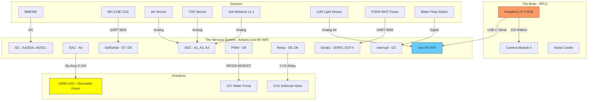

# Bio-Alpha Wiring Diagram v2 (Audited)

> [!NOTE]
> **v2 Audit Changes:** Fixed 7 errors from v1. Cross-referenced against Arduino Uno R4 WiFi datasheet and BOM.

## 1. System Topology



---

## 2. Complete Pin Allocation Table

| Pin | Component | Type | Protocol | Notes |
|-----|-----------|------|----------|-------|
| **USB-C** | Raspberry Pi 5 | `Serial` | USB CDC | Governor command stream. **Do not use D0/D1 for this.** |
| **A0** | 100W LED (Dimming) | `analogWrite` (DAC) | 12-bit DAC | Output 0–5V → LM358 Op-Amp → 0–10V to LED driver Dim+ port |
| **A1** | pH Sensor | `analogRead` | ADC | 0–5V analog. Requires calibration with pH 4.0 and 7.0 buffer solutions |
| **A2** | TDS/EC Sensor | `analogRead` | ADC | 0–5V analog. Measures nutrient ppm |
| **A3** | Capacitive Soil Moisture v1.2 | `analogRead` | ADC | 0–3.3V analog. **Do NOT use resistive type** (corrodes) |
| **A4** | BME280 (SDA) | `Wire` | I2C | Shared bus — address 0x76 or 0x77. Pull-ups NOT on PCB, add 4.7kΩ if bus is > 10cm |
| **A5** | BME280 (SCL) | `Wire` | I2C | Shared bus clock |
| **A6** | LDR Light Sensor | `analogRead` | ADC | Analog-only pin (no digital). Voltage divider with 10kΩ resistor |
| **D0 (RX)** | PZEM-004T (TX) | `Serial1` | HW UART | **Hardware Serial1** at 9600 baud. Cross-wired: PZEM TX → Arduino D0/RX |
| **D1 (TX)** | PZEM-004T (RX) | `Serial1` | HW UART | Cross-wired: Arduino D1/TX → PZEM RX |
| **D2** | Water Float Switch | `digitalRead` | Interrupt | **INT0** — `attachInterrupt()` for immediate Safety Agent response |
| **D3** | Exhaust Fan (12V) | `analogWrite` | PWM | Via IRF520 MOSFET. Vents hot air from Alpha Zone top. |
| **D4** | Air Pump (Aeration) | `digitalWrite` | Relay | 8-Ch Relay CH5. Prevents reservoir stagnation. |
| **D5** | CO2 Solenoid Valve | `digitalWrite` | Relay | 8-Ch Relay CH4 (or 2-Ch CH1). active-low (LOW=ON). |
| **D6** | Ultrasonic Mister | `digitalWrite` | Relay | 8-Ch Relay CH6. Active VPD control during dry weather. |
| **D7** | MH-Z19E CO2 (TX) | `SoftwareSerial` | SW UART | MH-Z19E TX → D7. 9600 baud. Returns CO2 ppm as integer |
| **D8** | MH-Z19E CO2 (RX) | `SoftwareSerial` | SW UART | Arduino D8 → MH-Z19E RX. Send read command: `{0xFF, 0x01, 0x86, ...}` |
| **D9** | 12V Water Pump | `analogWrite` | PWM | Via IRF520 MOSFET module. Handles irrigation. |
| **D10** | Dosing Pump: Nutrient A | `digitalWrite` | Relay | 8-Ch Relay CH1. |
| **D11** | Dosing Pump: Nutrient B | `digitalWrite` | Relay | 8-Ch Relay CH2. |
| **D12** | Dosing Pump: pH Down | `digitalWrite` | Relay | 8-Ch Relay CH3. |

### Free Pins (For Alpha v2 Expansion)

| Pin | Status |
|-----|---------|
| **D13** | Free (SCK, built-in LED) |

---

## 3. The Light Dimming Interface (Op-Amp Circuit)

```
Arduino A0 (DAC 0-5V)
       │
       ├──→ LM358 Non-Inverting Input (+)
       │
       │    LM358 Power:
       │      VCC ← 12V PSU
       │      GND ← Common Ground
       │
       │    LM358 Gain Config (×2):
       │      Rf = 10kΩ (feedback → output to inverting)
       │      Rg = 10kΩ (inverting → GND)
       │      Gain = 1 + (Rf/Rg) = 2.0
       │      Output = 0-5V × 2 = 0-10V ✅
       │
       └──→ LM358 Output ──→ LED Driver "Dim+" Port
                              LED Driver "Dim-" ──→ Common GND
```

> [!IMPORTANT]
> **Common Ground Rule:** Arduino GND, 12V PSU GND, and LED Driver Dim- **MUST** all be tied together. Floating floating = flicker = plant stress.

---

## 4. Power Distribution

| Rail | Source | Feeds | Current |
|------|--------|-------|---------|
| **5V USB** | RPi 5 (via USB-C to Arduino) | Arduino logic, sensors | ~200mA |
| **5V (Arduino out)** | Arduino 5V pin | BME280, pH module, TDS module, PZEM TTL, Float switch | ~150mA |
| **12V DC** | 12V 2A PSU | Water pump, CO2 solenoid (via relay), LM358 Op-Amp VCC | ~1.5A peak |
| **AC Mains** | Wall outlet | PZEM-004T CT clamp (measures, not powers), 100W LED driver | N/A |
| **5V 5A** | RPi 5 PSU (27W) | RPi 5 + Active Cooler | ~3A sustained |

> [!CAUTION]
> The PZEM-004T CT clamp goes around a **LIVE AC wire**. This is mains voltage. Do NOT touch during operation. Wire this component FIRST with AC power OFF.

---

## 5. Audit Changelog (v1 → v2)

| # | Issue in v1 | Fix in v2 |
|---|-------------|-----------|
| 1 | PZEM listed as "RX/TX Software Serial" (vague) | Fixed: Uses **Hardware Serial1** on D0/D1. More reliable than SoftwareSerial for continuous power monitoring. |
| 2 | I2C listed as "SDA/SCL" (no pin numbers) | Fixed: Explicitly **A4 (SDA) / A5 (SCL)** per R4 WiFi datasheet. |
| 3 | MH-Z19E CO2 sensor **missing entirely** | Fixed: Added on **SoftwareSerial D7/D8** at 9600 baud. |
| 4 | Capacitive Soil Moisture sensor **missing** | Fixed: Added on **A3** (analog read). |
| 5 | LDR Light sensor **missing** | Fixed: Added on **A6** (analog-only pin). |
| 6 | MOSFET listed as "IRFZ44N" (not in BOM) | Fixed: Corrected to **IRF520 MOSFET module** (BOM item #10, ₹79). |
| 7 | CO2 Solenoid listed as "PWM + MOSFET" | Fixed: Uses **2-Ch Relay Module** (BOM item #11, ₹55). Solenoid is ON/OFF, not variable speed. |
